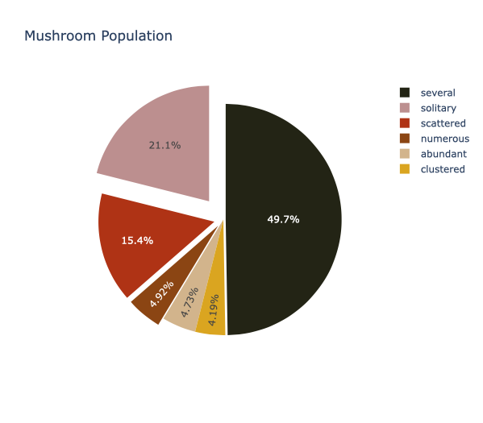
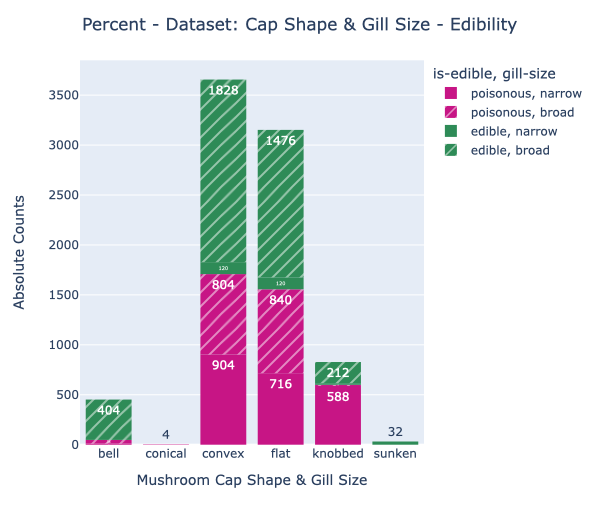
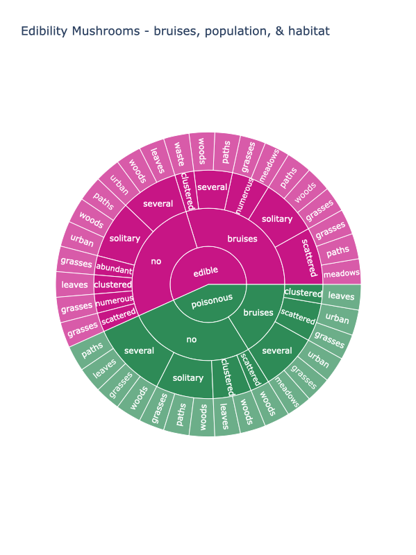
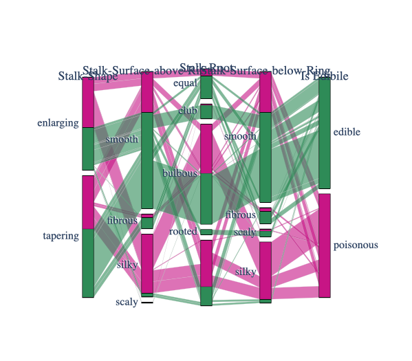

# Mushroom Classification EDA using Plotly 

mainly using .go charts

## Motivation

To get hands-on experience using Plotly to visualize multi-diemnsional categorical data.

## Data Source

The dataset was published as a [UCI Machine Learning Repository](https://archive.ics.uci.edu/ml/datasets/mushroom)

## Data Content

The dataset includes hypothetical samples corresponding to 23 species of gilled mushrooms in he Agaricus and Lepiota Family Mushroom drawn from The Audubon Society Field Guide to North American Mushrooms (1981). Each species is identified as definitely edible, definitely poisonous, or of unknown edibility and not recommended. This latter class was combined with the poisonous one.

## Data Preprocessing 

For readability purpose I renamed one of column names from <i>class</i> to <i>is-edible</i> and replaced default observations with human-readable equivalents.

## One-Dimensional Plot : Pie Chart

The pie chart is constructed using <i>population</i> feature.

Mushrooms are classified by the kind of populations they habituate in. The above pie chart represents the proportion of mushrooms in each population. Most of the mushrooms live in groups of several, while <i>less than 15% of the mushrooms</i> live in groups that can be <i>described as numerous, abundant, or clustered</i>. Approximately <i>one-third of the mushrooms</i> contained in this dataset <i>occur either solitarily or scattered</i>.

## Two-Dimensional Plot : Pie Chart with two Subplots

Do the proportion of mushrooms belonging to either population differ between edible and poisonous mushrooms?

Well the above question can be answered using two pie charts subplots, where each subplot corresponds to either edible or poisonous class. And yes, indeed, the proportions differ significantly between poisonous and edible mushrooms! <i>Almost three qurters of all poisonous mushrooms live</i> in populations described <i>as numerous</i>. On the other hand, only about <i>10% of edible mushrooms</i> are <i>counted</i> to the <i>numerous</i> sector. Furthermore, <i>all solitary mushrooms are edible</i>.

## Three-Dimensional Plot : Bar Chart

Shown above is absolute number of poisonous & edible mushrooms according to cap-shape & gill size. <i>Most mushroom's cap (top) is either convex or flat shaped.</i> Convex, flat & bell shaped mushrooms can either be poisonous or edible. Though, only sunken cap-shaped mushrooms are solely edible, while conical cap-shaped mushrooms are edible. Notice that both sunken and conical shaped mushrooms occur the least frequently. Convex and flat cap-shaped mushrooms have narrow & broad shaped gill-sizes in both poisonous & edible categories.

## Four-Dimensional Plot : Sunburst Chart

The above chart shows the num of mushrooms proportionally classified by their characteristics from root node to leaf node.

While there is almost an equal amount of poisonous & edible mushrooms, one can tell that <i>poisonous mushrooms are bruised much less frequently</i>. Poisonous mushrooms which are bruised and live in populations of which several grow in woods, in leaves, on grass or on paths. Bruised poisonous mushrooms live in scattered populations & preferably in urban or grassed habitats.

Edible mushrooms with bruises live mostly in solitary or scattered populations & most frequently in wooded areas. <i> Edible and not bruised mushrooms live mostly in scattered & abundant populations and prefer habitats of grasses & leaves.</i>

In conclusion, the sunburst chart shows how mushrooms differ grouped by the various characteristics.

## Five-Dimensional Plot : Parallel Coordinates Diagram

A mushroom distinguishes itself from other mushrooms through its stalk shape, stalk surface above the ring, stalk root, and its stalk surface below the ring.

Can those features explain a mushroom's edibility? Indeed, it does not seem to make much of a difference whether a mushroom stalk-shape is enlarging or tapering.

However, the surface above the mushroom-ring gives more information. If we were to select a <i>mushroom with a smooth or fibrous stalk-surface</i> one can feel more confident that the mushroom <i>is edible</i>. A <i>silky surface above the mushroom-ring should be avoided</i>.

The stalk-root should be club or equal.

If the stalk surface below the ring is smooth, there is good amount of chance it is an edible mushroom.</p?

The features as a combination increase the chance to distinguish poisonous and edible mushrooms.

