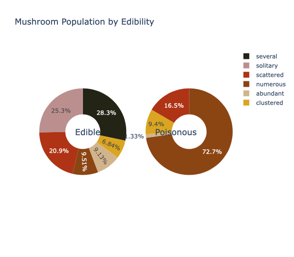

# Mushroom Classification EDA using Plotly 

mainly using .go charts

## Motivation

To get hands-on experience using Plotly to visualize multi-diemnsional categorical data.

## Data Source

The dataset was published as a [UCI Machine Learning Repository](https://archive.ics.uci.edu/ml/datasets/mushroom)

## Data Content

The dataset includes hypothetical samples corresponding to 23 species of gilled mushrooms in he Agaricus and Lepiota Family Mushroom drawn from The Audubon Society Field Guide to North American Mushrooms (1981). Each species is identified as definitely edible, definitely poisonous, or of unknown edibility and not recommended. This latter class was combined with the poisonous one.

## Data Preprocessing 

For readability purpose I renamed one of column names from <i>class</i> to <i>is-edible</i> and replaced default observations with human-readable equivalents.

## One-Dimensional Plot

The pie chart is constructed using <i>population</i> feature.

Mushrooms are classified by the kind of populations they habituate in. The above pie chart represents the proportion of mushrooms in each population. Most of the mushrooms live in groups of several, while <i>less than 15% of the mushrooms</i> live in groups that can be <i>described as numerous, abundant, or clustered</i>. Approximately <i>one-third of the mushrooms</i> contained in this dataset <i>occur either solitarily or scattered</i>.

## Two-Dimensional Plot

Do the proportion of mushrooms belonging to either population differ between edible and poisonous mushrooms?

Well the above question can be answered using two pie charts subplots, where each subplot corresponds to either edible or poisonous class. And yes, indeed, the proportions differ significantly between poisonous and edible mushrooms! <i>Almost 3 qurters of all poisonous mushrooms live</i> in populartions describes <i>as numerous</i>. On the other hand, only about <i>10% of edible mushrooms</i> are <i>counted</i> to the <i>numerous</i> sector. Furthermore, <i>all solitary mushrooms are edible<i>.

